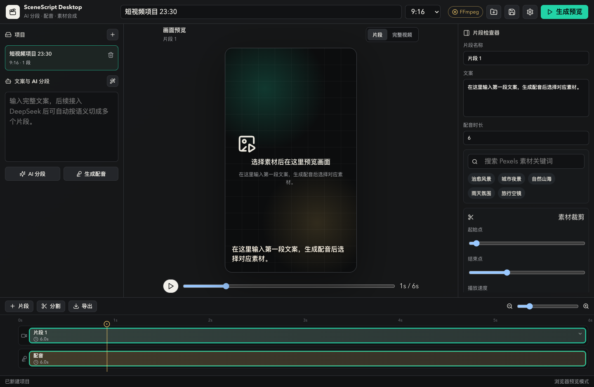

# SceneScript Desktop

**本地优先的 AI 短视频生成器** - 从脚本/音频到成片，一站式自动化。粘贴文案或导入录音，AI 自动分镜、匹配素材、克隆配音、生成字幕，配合剪映式的多轨道编辑能力完成精修。全程本地运行，数据不上传。



## ✨ 核心特性

### AI 自动化流水线

- 🤖 **双模式分镜** - 文案模式（DeepSeek 拆段）/ 音频模式（Whisper 句级 ASR + 真实时间戳编排）
- 🎙️ **克隆配音** - 上传参考音频，AI 克隆音色生成旁白；支持按段或整段生成
- 📝 **双语字幕** - 中英文分轨，DeepSeek 翻译不改时间戳，jieba 中文分词支持逐字 karaoke 高亮
- 🎬 **自动素材匹配** - Pexels 关键词搜索，按时长优先挑选够长的素材，避免循环/裁剪
- 🔄 **一键流水线** - 从脚本到初剪自动跑完分镜 -> 素材 -> 配音 -> 字幕

### 剪映式编辑能力

- 🎞️ **多轨道** - 视频 / 图片 / 配音 / 音频 / 字幕，可锁定、隐藏、调高度
- 🎯 **关键帧动画** - 位置 / 缩放 / 不透明度 / 旋转 / 音量
- ⏩ **曲线变速** - 自定义控制点 + 蒙太奇 / 英雄时刻 / 子弹时间预设
- 🌀 **转场系统** - fade / wipe / slide / circle / push 等，入场出场独立配置
- 🖼️ **画中画** - 真实预览，独立 transform / 混合模式 / 蒙版
- 🎭 **蒙版** - 线性 / 镜像 / 圆形 / 矩形，支持羽化与反转
- ✨ **视觉特效** - vignette / flicker / shake / glow / mirror / invert / grayscale
- 🎨 **LUT 滤镜** - 10 种 3D LUT 预设 + 色彩调节（亮度/对比度/饱和度/色温/色调），预览 = 导出
- 📝 **字幕样式** - 描边 / 背景 / 阴影 / 字间距 / 行高 / 入场出场动画 / 旋转 / 缩放

### 预览与导出

- 🚀 **双路径预览** - WebGL 合成器 / WebCodecs 解码，按能力自动选择
- 📍 **字幕对齐** - 前端预览位置与 ASS 烧录严格一致（`Alignment=5` + `\pos` 精确定位）
- 🎬 **HEVC 编码** - H.264 / HEVC 可选，支持仅音频导出（mp3）
- ⚡ **GPU 加速** - VideoToolbox (macOS) / NVENC (NVIDIA) / QSV (Intel) 自动检测
- 🔊 **音频混音** - 多轨 amix + alimiter 防削波 + 可选降噪（afftdn）+ 变速保持音高（atempo）
- 📤 **进度可控** - 真实导出进度 + 取消

## 🛠️ 技术栈

| 层 | 技术 |
|---|---|
| 前端 | React 19 + TypeScript + Vite + Zustand + react-moveable |
| 后端 | Rust + Tauri 2 + tokio + rusqlite |
| 渲染 | FFmpeg（本地命令行调用，叠加/转场/字幕烧录/混音） |
| AI | DeepSeek（分镜 + 翻译）、whisper.cpp（ASR）、自建 TTS（配音） |
| 中文处理 | jieba-rs（分词 + 逐字高亮时间戳） |
| 素材源 | Pexels Video / Photo API |

## 📋 前置条件

### 必需

- [Rust](https://rustup.rs/) 工具链
- [Node.js](https://nodejs.org/) 18+
- [FFmpeg](https://ffmpeg.org/)（含 ffprobe，需在 PATH 中）

### 可选（按需配置）

- [DeepSeek API Key](https://platform.deepseek.com/) - AI 分段与翻译
- [Pexels API Key](https://www.pexels.com/api/) - 素材搜索
- [whisper.cpp](https://github.com/ggerganov/whisper.cpp) - 自动字幕（macOS: `brew install whisper-cpp`）
- TTS 服务 - 克隆配音（默认使用公共服务，可自建）

## 🚀 快速开始

```bash
# 安装依赖
npm install

# 开发模式运行（前端 HMR + Rust 后端）
npm run tauri:dev

# 构建生产版本
npm run tauri:build
```

构建产物位于 `src-tauri/target/release/bundle/`。

首次启动后，在「设置」中配置：

1. **DeepSeek API Key** - AI 分段与翻译
2. **Pexels API Key** - 素材搜索
3. **TTS 服务地址** - 配音
4. **Whisper 路径与模型** - 字幕识别

## 📖 使用流程

### 文案模式（从零创作）

```
粘贴文案
  ↓
点击「AI 分段」-> 自动拆分多段，每段匹配 Pexels 素材
  ↓
选择音色 -> 点击「全部配音」-> AI 克隆配音
  ↓
点击「识别字幕」-> Whisper 识别 + AI 整理（可选翻译）
  ↓
预览区调整字幕样式 / 位置 / 关键帧
  ↓
点击「导出」-> 选择分辨率与编码 -> GPU 加速渲染
```

### 音频模式（已有录音）

```
导入录音文件
  ↓
Whisper 句级 ASR -> 按真实时间戳编排轨道
  ↓
AI 为每句配画面关键词 -> 自动搜索 Pexels 素材
  ↓
（可选）识别字幕 -> 双语翻译
  ↓
预览精修 -> 导出
```

## 🏗️ 项目结构

```
tauri-client/
├── src/                          # React 前端
│   ├── App.tsx                   #   主界面 + 业务编排
│   ├── panels/                   #   功能面板
│   │   ├── GenerateWizard.tsx    #     AI 生成向导
│   │   ├── EdlPreview.tsx        #     分镜预览
│   │   ├── ExportDialog.tsx      #     导出对话框
│   │   ├── MediaPanel.tsx        #     素材库
│   │   ├── TextPanel.tsx         #     字幕样式
│   │   ├── TransitionPanel.tsx   #     转场
│   │   └── AudioPanel.tsx        #     音频
│   ├── preview/                  #   预览引擎
│   │   ├── PreviewEngine.ts     #     主预览（MediaElementPool + Web Audio）
│   │   ├── WebCodecsRenderer.ts  #     WebCodecs 解码路径
│   │   ├── WebGLCompositor.ts   #     WebGL 多层合成
│   │   ├── FilterRenderer.ts     #     LUT + 色彩 shader
│   │   └── SubtitleOverlay.tsx   #     字幕编辑叠层
│   ├── editor/                   #   编辑工具
│   │   ├── keyframes.ts          #     关键帧采样
│   │   ├── speedCurve.ts         #     曲线变速
│   │   ├── transitions.ts        #     转场
│   │   └── pipeline.ts           #     流水线
│   ├── timeline/                  #   时间线组件（拖拽/吸附/波形/多选）
│   ├── store/                    #   Zustand 状态管理
│   └── types.ts                  #   数据模型
├── src-tauri/src/                # Rust 后端
│   ├── commands.rs               #   Tauri 命令入口
│   ├── ai.rs                    #   DeepSeek 调用
│   ├── asr.rs                   #   Whisper + 字幕分段
│   ├── tts.rs                   #   TTS 合成
│   ├── ffmpeg.rs                #   FFmpeg 渲染 + 音频混音
│   ├── pexels.rs                #   Pexels 素材搜索
│   ├── storage.rs               #   SQLite 持久化
│   └── models.rs                #   数据模型
├── luts/                         # .cube LUT 文件
└── package.json
```

## ⌨️ 快捷键

| 快捷键 | 功能 |
|--------|------|
| `Space` | 播放/暂停 |
| `← / →` | 帧级步进（Shift = 秒级）|
| `Home / End` | 跳到开头/结尾 |
| `Ctrl+B` | 在播放头处分割 |
| `Ctrl+Z / Y` | 撤销/重做 |
| `Ctrl+C / V` | 复制/粘贴片段 |
| `Ctrl+D` | 复制片段 |
| `Delete` | 涟漪删除 |
| `Ctrl+滚轮` | 时间线缩放 |
| `+ / -` | 放大/缩小 |

## 🔧 开发指南

- **前端改动** - Vite HMR 自动热更新，无需重启
- **Rust 改动** - 需重启 `npm run tauri:dev`
- **类型检查** - `npx tsc --noEmit`
- **Rust 检查** - `cd src-tauri && cargo check`

### 核心数据模型

- **Clip** - 时间线片段，含 `startOnTrack` / `duration` / `sourceIn` / `sourceOut` / 变换 / 关键帧 / 滤镜 / 转场
- **Track** - 轨道，按 `order` 降序排列（底层在前）
- **MediaSource** - 素材库条目（视频/音频/图片），支持代理路径（低清预览）
- **预览/导出对齐** - 字幕位置、字号、换行均通过 `videoWidthForProject` 计算的 `fontScale` 缩放，保证所见即所得

## 🗺️ 路线图

- [x] AI 脚本到视频全流程
- [x] 多轨道编辑 + 画中画
- [x] LUT 滤镜 + 色彩调节
- [x] GPU 加速导出（VideoToolbox/NVENC/QSV）
- [x] 逐字高亮字幕（karaoke）
- [x] 一键生成流水线
- [x] 关键帧动画
- [x] 曲线变速 + 蒙版
- [x] 转场系统增强
- [x] 双语字幕分轨
- [x] HEVC 编码 + 仅音频导出
- [ ] 英文界面（i18n）
- [ ] 模板系统（一键套用风格）
- [ ] 更多 AI 素材源（除 Pexels 外）

## 📄 许可证

[MIT License](LICENSE)

## 🤝 贡献

欢迎提交 Issue 和 PR。开发文档与设计笔记见仓库内的 `*.md` 文件。
