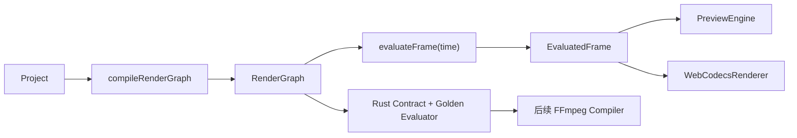

# SceneScript RenderGraph A1 设计

## 目标

建立平台无关的运行时 RenderGraph 和确定性时间点求值器，让默认预览与 WebCodecs 预览消费同一份 `EvaluatedFrame`。Rust 本轮建立对应契约和黄金测试，但暂不替换 FFmpeg 主渲染流程。

本阶段解决的是“编辑语义被重复实现”的根因，而不是继续分别修补两个预览器。完成后，活跃图层、源时间、关键帧、转场、音量和字幕状态只由求值器计算一次，渲染器只负责执行结果。

## 非目标

- 本阶段不重写 FFmpeg 分段渲染器。
- 本阶段不修改项目持久化格式或 SQLite payload。
- 本阶段不新增 npm 或 Cargo 依赖。
- 本阶段不把 WebCodecs 设为默认预览路径。
- 本阶段不实现新的剪映功能。
- 本阶段不统一 GPU shader 与 FFmpeg filter 的像素级结果。

## 方案选择

采用“共享 JSON 契约 + TypeScript/Rust 双端纯函数求值器 + 黄金用例”的方案。

未采用 TypeScript 生成完整导出计划的方案，因为它会让后台导出依赖前端状态和 IPC payload。未采用 Rust 单一求值器方案，因为实时预览不能按帧跨 IPC 调用。

## 架构



## 模块边界

### `src/renderGraph/types.ts`

只定义运行时契约，不读取 DOM、不调用 Tauri、不持有可变状态。

```ts
export type RenderGraph = {
  duration: number;
  canvas: { width: number; height: number };
  layers: RenderLayer[];
};

export type RenderLayer = {
  id: string;
  trackId: string;
  trackKind: TrackKind;
  trackOrder: number;
  clip: Clip;
  media: MediaSource | null;
};

export type EvaluatedFrame = {
  time: number;
  visualLayers: EvaluatedVisualLayer[];
  audioLayers: EvaluatedAudioLayer[];
  subtitleLayers: EvaluatedSubtitleLayer[];
};
```

`RenderLayer.clip` 和 `RenderLayer.media` 使用编译时深拷贝快照，避免项目对象后续突变改变已有 RenderGraph。

### `src/renderGraph/compileRenderGraph.ts`

输入 `Project`，输出不可变语义快照：

- 排除 hidden 轨和没有对应轨道的孤儿 clip。
- 关联 `sourceId` 与 `MediaSource`。
- 保存轨道类型和 order。
- 输出时长使用 `projectOutputDuration`。
- 逻辑画布使用项目比例对应的固定基准尺寸：`9:16 = 1080×1920`、`16:9 = 1920×1080`、`1:1 = 1080×1080`。
- 图层顺序固定为 `track.order` 降序后按 `startOnTrack`、clip id 排序；数组前部为底层，后部为上层。

固定逻辑画布只用于归一化求值。预览容器和导出分辨率在执行阶段按比例缩放，不改变关键帧和字幕布局语义。

### `src/renderGraph/evaluateFrame.ts`

输入 `RenderGraph` 与绝对时间，输出纯数据 `EvaluatedFrame`。

#### 视觉层

- 仅返回 `video` 和 `image` 轨中处于 `[startOnTrack, startOnTrack + duration)` 的 clip。
- 使用 `timelineToSourceTime` 计算源时间。
- 使用现有关键帧采样计算 x、y、scale、opacity、rotation。
- 输出静态 brightness、contrast、saturation、temperature、tint、crop、mask、filter 和 visualEffects。
- 输出 `transitionInProgress` 与 `transitionOutProgress`，范围为 0..1。无转场时为 1。
- 输出 `effectiveOpacity = keyframe/static opacity × transition multiplier`。

#### 音频层

- 返回 `video`、`audio`、`voiceover` 轨中的可播放媒体 clip。
- muted 轨不返回音频层，但仍保留 RenderGraph 总时长。
- 使用统一源时间与瞬时倍速。
- 使用 volume 关键帧覆盖静态 volume。
- 淡入增益为 `min(1, relativeTime / fadeIn)`；淡出增益为 `min(1, remainingTime / fadeOut)`。
- 输出音量限制在 0..2，最终增益为 volume 与淡入淡出增益的乘积。

#### 字幕层

- 返回 subtitle 轨中的活跃 clip。
- 输出合并后的默认字幕样式、文本、words 和层级。
- `activeWordIndex` 使用绝对项目时间匹配 `WordCue.start/end`；当旧项目的 words 看起来是 clip 相对时间时，使用 `clip.startOnTrack` 偏移后再匹配。
- 本阶段不在求值器中计算 CSS 动画 class。

### 预览执行器

`PreviewEngine` 与 `WebCodecsRenderer` 各自持有编译后的 RenderGraph。`setProject()` 时重新编译，tick/seek 时调用 `evaluateFrame()`。

两个执行器继续保留各自的媒体池、DOM、Canvas、WebGL 和音频调度代码，但不得再自行完成以下工作：

- 轨道隐藏过滤；
- 活跃 clip 查找与排序；
- 源时间映射；
- 关键帧采样；
- 转场透明度计算；
- 音频淡入淡出增益计算；
- 字幕活跃状态计算。

`EngineState` 继续暴露现有 Clip 数组，避免本阶段大面积修改 React UI。执行器从 `EvaluatedFrame.layer.clip` 生成这些兼容字段。

## Rust 契约

在 `src-tauri/src/render_graph.rs` 定义与 TypeScript JSON 结构一致的 Rust 数据结构和纯函数：

- `compile_render_graph(project: &Project) -> RenderGraph`
- `evaluate_frame(graph: &RenderGraph, time: f64) -> EvaluatedFrame`

Rust A1 只覆盖 FFmpeg 后续需要的稳定语义：层顺序、活跃区间、源时间、基础关键帧、音量淡入淡出和字幕层。像素滤镜编译留到 A2。

## 跨语言黄金用例

新增 `tests/fixtures/render-graph-golden.json`，其中保存输入项目、时间点和期望的规范化结果。

规范化结果只包含跨平台稳定字段：

- 图层 id 和顺序；
- sourceTime，四舍五入到 6 位小数；
- transform、opacity、volume 与 fade gain；
- transition progress；
- subtitle id 与 activeWordIndex。

TypeScript 测试直接读取 fixture。Rust 测试通过 `include_str!` 读取同一文件，确保两个实现由同一批场景约束。

黄金场景至少包含：

1. 多视觉轨与稳定层级。
2. hidden 与 muted 轨差异。
3. 2x、曲线变速、`speed < 0` 和 `reverse=true`。
4. 位置、缩放、旋转、不透明度和音量关键帧。
5. 入场与出场转场。
6. 淡入淡出音频。
7. 字幕和逐词状态。
8. 无素材、孤儿 clip 和边界时间。

## 错误与兼容策略

- 非法时间、NaN 和负时间统一 clamp 到 0。
- 缺失轨道的 clip 在编译阶段忽略。
- 缺失媒体的视觉/音频 clip 保留 layer 诊断信息，但不进入可播放的 evaluated layer。
- sourceIn/sourceOut 非法时沿用 `clipTimeMap` 的受控 clamp。
- 未知比例使用 `1920×1080`。
- 未知转场按无转场处理，不影响基础图层显示。

## 性能约束

- `compileRenderGraph` 只在项目对象变化时执行。
- 求值器不进行 `structuredClone`、媒体加载、DOM 查询或 IPC。
- 编译结果预先按轨道和开始时间排序；A1 可线性扫描，后续超过 1000 clip 时再引入区间索引。
- 每帧求值不得修改 Project、RenderGraph 或 Clip。

## 验收标准

1. TypeScript 与 Rust 对同一黄金 fixture 输出相同规范化结果。
2. 默认预览与 WebCodecs 在同一项目和时间点获得相同的视觉、音频和字幕层顺序。
3. 两个预览器不再包含重复的源时间、关键帧、转场透明度和活跃字幕求值代码。
4. 现有 P0 回归测试继续通过。
5. `npm run build`、`npm run test:ts`、`cargo test --locked` 和 `git diff --check` 全部通过。

## 后续 A2

A2 将让 FFmpeg 使用 Rust RenderGraph 编译器，并把视觉层编译为 segment/filter plan。A2 不再重新定义时间线语义，只负责把 `EvaluatedFrame` 和时间区间转换成 FFmpeg 输入、滤镜和合成命令。
