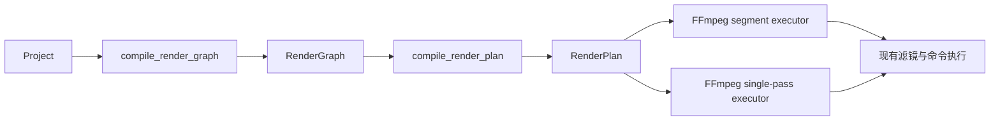

# SceneScript RenderPlan A2 设计

## 目标

让 Rust FFmpeg 导出链路消费 A1 的 `RenderGraph`，由一个确定性的 `RenderPlan` 编译器负责视频区间、活跃图层、转场和单遍渲染资格判断。FFmpeg 只把计划翻译为现有命令，不再重新扫描 `Project.tracks`、`Project.clips` 推导编辑语义。

本阶段解决预览与导出继续分叉的根因，同时保持现有 FFmpeg 编码、滤镜和文件执行路径不变。

## 非目标

- 不重写 FFmpeg filter builder。
- 不改变音频混音与字幕烧录命令。
- 不新增 npm 或 Cargo 依赖。
- 不修改项目持久化格式。
- 不追求 WebCodecs 与 FFmpeg 像素级一致。
- 不在本阶段实现嵌套序列、复合片段或 GPU 导出。

## 方案选择

### 方案 A：只把现有辅助函数移入 `render_graph.rs`

改动最小，但仍然以 `Clip` 列表和轨道 id 为输入，不能证明 FFmpeg 真正消费了 RenderGraph，也无法消除重复过滤和排序。

### 方案 B：RenderGraph 编译为带图层索引的 RenderPlan（采用）

`RenderPlan` 保存时间区间、活跃 RenderGraph 图层索引、转场元数据和单遍优化计划。FFmpeg 通过索引取得 clip 快照并执行现有渲染函数。

优点是边界清晰、无额外依赖、可渐进替换命令编译；缺点是 A2 仍保留部分 FFmpeg filter 对 clip 字段的直接读取。

### 方案 C：一次性生成完整 FFmpeg AST

长期最统一，但会同时重写区间规划、滤镜构建、音频和字幕，回归面过大，不适合作为 A1 后的第一步。

## 架构



## 模块边界

### `src-tauri/src/render_plan.rs`

定义纯 Rust、无 I/O 的后端计划契约：

```rust
pub struct RenderPlan {
    pub duration: f64,
    pub visual_layer_indices: Vec<usize>,
    pub units: Vec<RenderUnit>,
    pub single_pass: Option<SinglePassPlan>,
}

pub enum RenderUnit {
    Normal {
        start: f64,
        end: f64,
        layer_indices: Vec<usize>,
    },
    Transition {
        start: f64,
        boundary: f64,
        end: f64,
        previous_layer_indices: Vec<usize>,
        next_layer_indices: Vec<usize>,
        transition: PlannedTransition,
    },
}
```

所有索引都指向同一个 `RenderGraph.layers` 快照，避免再次复制 `Clip` 和 `MediaSource`。

### 区间编译

- 视觉层只来自 RenderGraph 中有媒体的 `video` 和 `image` 层。
- 层级顺序直接继承 RenderGraph：数组前部为底层，后部为上层。
- 普通区间按视觉 clip 起止边界切分；尾部音频或字幕延长总时长时生成无视觉层的黑屏区间。
- 每个普通区间预计算活跃图层索引，FFmpeg 不再调用 `active_clips_for_window`。
- 小于等于 `0.05s` 的碎片区间不生成执行单元，沿用现有容差。

### 转场编译

- 只在同一轨道、首尾相接的相邻 clip 之间建立转场。
- 优先使用 incoming clip 的 `transitionIn`；没有时使用 outgoing clip 的 `transitionOut`。
- 转场时长限制为配置时长、前后 clip 时长和边界时间的最小值。
- 同一时间点存在多轨转场时，选择视觉层级最高的轨道作为合成转场，结果不再依赖 `Project.clips` 的存储顺序。
- 转场单元预计算前后合成所需图层和 FFmpeg xfade 名称；执行器不再查找 transition clip。

### 单遍优化计划

- 基础轨道取 RenderGraph 中最底层视觉轨道。
- 基础 clip 必须连续覆盖整个 RenderGraph 时长。
- 所有 clip 必须满足现有单遍执行能力：媒体已绑定、无转场、无曲线变速、正向播放、无蒙版，且变换在现有支持范围内。
- 输出基础层和覆盖层索引，现有 `render_single_pass_video_graph` 保持命令构建职责。

### `src-tauri/src/ffmpeg.rs`

`render_project_video` 开始时只编译一次 RenderGraph 和 RenderPlan：

1. RenderPlan 无视觉层时返回现有错误。
2. RenderPlan 的 `duration` 成为视频输出时长。
3. 普通单元直接消费 `layer_indices`。
4. 转场单元直接消费前后图层索引和转场名称。
5. 单遍执行器消费 `SinglePassPlan`，删除旧 planner。

FFmpeg 的媒体本地化、filter 字符串、编码器选择、分段文件、concat、音频混音和字幕烧录保持原样。

## 测试策略

- 扩展共享黄金 fixture，声明 RenderPlan 的视觉层和普通区间预期。
- Rust 单元测试验证隐藏轨、孤儿 clip、图层顺序和黑屏尾部。
- Rust 单元测试验证 `transitionIn`、`transitionOut`、多轨同点转场的确定性选择。
- Rust 单元测试验证简单叠加可进入单遍路径，复杂变换会回退分段路径。
- 迁移后保留 FFmpeg 时长脚本，验证纯视频、音频尾部和字幕尾部场景。

## 完成标准

- `ffmpeg.rs` 不再定义或调用 `active_clips_for_window`、`build_render_units`、`plan_single_pass_video_graph`。
- `render_transition_unit` 不再扫描全部 clips 查找转场或活跃层。
- Rust RenderPlan 测试、现有 Rust/TypeScript 测试、前端构建和三个 FFmpeg 时长场景全部通过。
- 不新增依赖，不提交用户未要求的 commit。
